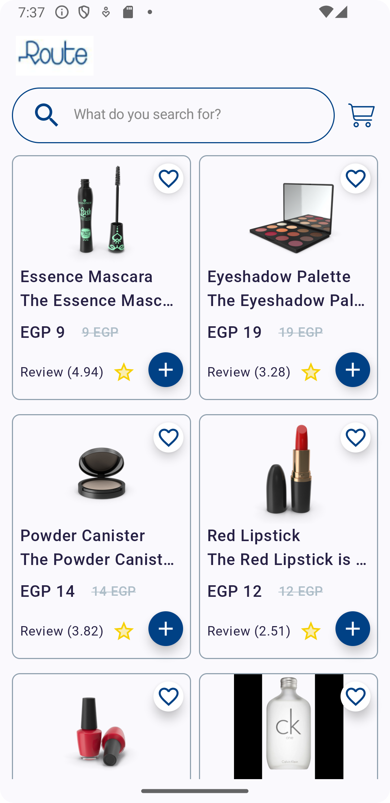

# Android Product Display Application

This Android application fetches product data from the [Dummy JSON Products API](https://dummyjson.com/products) and displays the products in a user-friendly interface. The application is built using Kotlin and Jetpack Compose.

## Features

- Fetches product data from the API
- Displays product information in a list
- Detailed view of each product
- Simple and clean UI using Jetpack Compose

## Getting Started

These instructions will help you get a copy of the project up and running on your local machine for development and testing purposes.

### Prerequisites

- Android Studio (latest version recommended)
- Kotlin
- Internet connection (for fetching data from the API)

### Installing

1. **Clone the repository:**

   ```sh
   git clone https://github.com/Ahmed-P-Mostafa/routetask.git
2. **Open the project in Android Studio:**

 - Open Android Studio
 - Click on Open an existing project
 - Select the cloned repository folder

3. **Build the project:**

- Click on Build > Make Project or use the shortcut Ctrl+F9

4. **Run the application:**

- Click on Run > Run 'app' or use the shortcut Shift+F10
- Select an emulator or connect your Android device
### Usage
Once the application is running, it will automatically fetch the products from the API and display them in a list. Clicking on a product will navigate to a detailed view showing more information about the product.

### Project Structure
The project follows a clean architecture approach with the following structure:

`data` - Contains data models and API service definitions

`repository` - Contains the repository that interacts with the API service

`ui` - Contains UI components and screens using Jetpack Compose

`viewmodel` - Contains ViewModel classes for managing UI-related data
### Built With

- [Kotlin](https://kotlinlang.org/) - Programming language

- [Jetpack Compose](https://developer.android.com/jetpack/compose) - UI toolkit

- [Retrofit](https://square.github.io/retrofit/) - Type-safe HTTP client for Android

- [Hilt](https://developer.android.com/training/dependency-injection/hilt-android) - Dependency injection library

### Contributing
Contributions are welcome! Please fork the repository and create a pull request with your changes.

1. **Fork the repository**

2. **Create your feature branch:**

   ```sh
   git checkout -b feature/my-new-feature
3. **Commit your changes:**

   ```sh
   git clone https://github.com/Ahmed-P-Mostafa/routetask.git
4. Push to the branch:

   ```sh
   git push origin feature/my-new-feature
5. **Create a new Pull Request**

### Authors
- [Ahmed Mostafa](https://github.com/Ahmed-P-Mostafa/)


